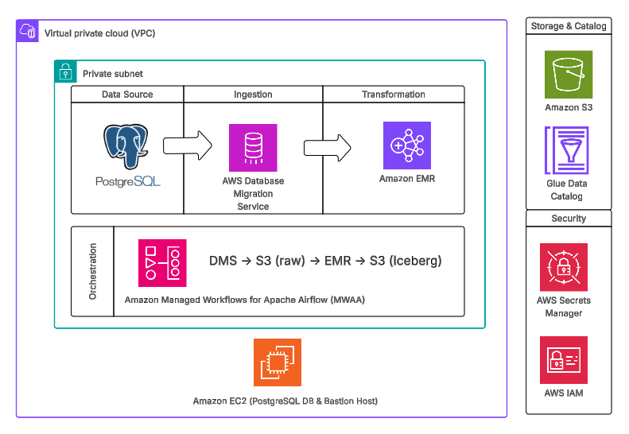

## 🚀 Data Pipeline: PostgreSQL → S3 → Iceberg (via DMS, Glue, EMR, MWAA)

This project sets up a secure, end-to-end data pipeline on AWS, using services including EC2, DMS, S3, Glue, EMR, and MWAA (Airflow). The pipeline extracts data from a PostgreSQL server running in a private subnet, transforms it using Spark on EMR, and stores the result in Apache Iceberg format for analytics and lakehouse use cases.



### 🔧 Components

1. EC2 PostgreSQL Server (Private Subnet)

   - Runs PostgreSQL inside a VPC private subnet.
   - Security groups allow access only from a Bastion Host or DMS replication instance.

2. EC2 Bastion Host

   - Located in a public subnet.
   - Used for SSH access to PostgreSQL for debugging or manual testing.
   - Github Action workflow triggers airflow dag through the bastion host.

3. AWS DMS (Database Migration Service)

   - Source Endpoint: PostgreSQL (with Secrets Manager and TLS disabled)
   - Target Endpoint: Amazon S3 (writes Parquet files to a designated raw zone folder)
   - Transfers table data incrementally or in full mode.
   - Runs inside a private subnet with appropriate route table/NAT access.

4. Amazon S3

   - Used as raw data landing zone.
   - Data is written in Parquet format, optionally partitioned.

5. AWS Glue Data Catalog

   - Manual table definitions map S3 data to schema.
   - Databases and Tables are referenced by the EMR Spark job for transformation and Iceberg writing.

6. Amazon EMR

   - Spark job runs from an EMR Step submitted by Airflow.
   - Reads Parquet from raw S3 path, performs transformations, and writes Iceberg tables (with Hive metastore via Glue).
   - EMR is configured with:
   - Glue Catalog integration
   - Iceberg enabled (iceberg.enabled=true)
   - Spark-Hive configurations

7. Amazon MWAA (Managed Workflows for Apache Airflow)

   - Orchestrates the pipeline:
   - Starts DMS task via PythonOperator or DmsStartTaskOperator
   - Waits for DMS task to complete with DmsTaskCompletedSensor
   - Triggers EMR job with EmrCreateJobFlowOperator + EmrAddStepsOperator
   - Monitors Spark job status with EmrStepSensor
   - Terminates EMR cluster with EmrTerminateJobFlowOperator

8. IAM and Networking
   - IAM roles are fine-grained:
   - DMS role allows Secrets Manager + S3
   - EMR and Glue have access to S3 buckets, Glue tables, and logs
   - All components use private subnets, with access enabled via NAT gateway and VPC endpoints as needed.

### Airflow DAG


### 🛠 Infrastructure as Code (IaC)

This project uses Terraform to provision and manage all AWS resources in a reproducible and scalable way. Key infrastructure components deployed via Terraform include:

- Amazon EC2 instances (PostgreSQL server and bastion host)
- AWS DMS resources (replication instance, source & target endpoints, and task)
- Amazon MWAA environment with appropriate IAM roles and S3 DAG deployment
- Amazon EMR cluster and security configurations
- S3 buckets for raw and transformed data storage
- AWS Glue Data Catalog for schema management
- IAM roles and policies with least privilege access

Terraform modules are organized to support modular deployment (e.g., vpc, mwaa, emr, dms, glue, s3), and state is optionally stored in S3 for remote collaboration.

⚙️ Dynamic DAG Generation

Terraform is also used to automatically generate and deploy Airflow DAGs. This is achieved by:
• Using Terraform’s templatefile() function to fill a Python DAG template with live AWS resource values (e.g., DMS task ARN, EMR subnet ID, S3 paths).
• Writing the rendered Python file to the appropriate DAGs folder (e.g., scripts/dags/dms_to_emr_pipeline.py).
• Uploading the generated DAG to the MWAA DAGs S3 bucket as part of deployment.

This approach ensures that your DAG logic stays tightly integrated with the actual infrastructure, reducing manual synchronization errors and enabling seamless CI/CD workflows.

### 🗂 Directory Structure

```
.
├── environments/
│   └── dev/
│       ├── main.tf          # Terraform main module
│       └── terraform.tfvars
├── modules/
│   ├── ec2/                 # PostgreSQL and Bastion setup
│   ├── dms/                 # DMS instance, endpoints, tasks
│   ├── emr/                 # EMR cluster and step configuration
│   ├── mwaa/                # MWAA and DAG bucket config
│   ├── glue_catalog_table/ # Glue tables pointing to S3
│   └── s3/                  # S3 buckets: raw and processed
├── scripts/
│   ├── trigger_dag.sh       # Trigger MWAA DAG via bastion and CLI token
│   └── dags/
│       └── dms_to_emr_pipeline.py
└── README.md
```

🚀 Getting Started

1. Terraform Deployment

Run the pipeline components selectively via GitHub Actions or CLI:

```
terraform init
terraform plan
terraform apply -target=module.s3
terraform apply -target=module.vpc -target=module.ec2
terraform apply -target=module.glue_catalog_table
terraform apply -target=module.emr
terraform apply -target=module.mwaa
```

2. Trigger the DAG

The GitHub Actions workflow triggers Airflow DAG through Bastion:

```
./scripts/trigger_dag.sh
```

🧑‍💻 Author

Chien Hsiang Yeh
[LinkedIn](https://www.linkedin.com/in/chienhsiang-yeh/)
